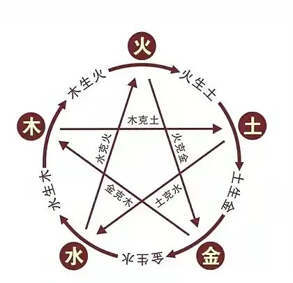

# 建立中醫的世界觀

一切學說都要依賴其哲學觀，世界觀。一切世界觀的基礎是相信。任何邏輯思維的出發點和他的支柱，一定是來源於信念或者信仰。也就是相信。有神论和无神论根本的分歧在于相信的东西不同。

學習中醫，需要先建立中醫的世界觀。先審視自己的世界觀，用追問和探索的方式來進行。產生日常摩擦和爭論的關鍵，是因為彼此的世界觀不同，信念、信仰、相信的东西不同。

醫不叩門，學中醫先做好自己，用自己的改變和正向的能量去影響別人，永遠不要試圖說服別人。

# 信念差异

人與人，從根本上就是不同的。因為不同，所以我們彼此之間才更需要交流。這是大家瞭解世界，認識世界的關鍵所在。

信念差異是人類達成共識的根本鴻溝，但不等於人與人無法溝通。學哲學也好，學中醫也好，是為了更好的與人溝通，而不是制造隔閡。

人類的信念不同，觀察世界的角度不同，所有人觀察世界的結論如同盲人摸象，千差萬別，所以彼此之間應該互相來參照。
**普遍联系**

道家的根本信念，天人不二，萬物存在著普遍聯繫。

<table><tr><td bgcolor=#fcfafc> 宇宙大人身，人身小宇宙。 </td></tr></table>

中醫有一個思路叫取類比象或者叫取象比類。比如核桃，中國人就認為他長得像大腦，所以吃核桃補腦子。五行归纳属于普遍联系。

徐老師講學中醫的人一定要有一個思維，遇到任何問題，都要知道有一個答案叫“不一定”，“不一定”的原因就是變量參數各種因素太多了。

**逻辑联系**

科學最重視的叫邏輯聯系。五行相生相克属于逻辑联系。

> 親人要生，生人要熟，熟人要親。
>
> 用兩年學會說話，用一生學會閉嘴。

# 陰陽

## 陰陽與應象

在不同外形背後所具有的共性或者叫做本質，就是象。

宇宙的本質是天人不二。陰陽是古人用來理解世界的工具，劃分陰陽是為了更好的認識世界，而並不是指世界是一分為二、涇渭分明的兩個板塊。

通過抽象總結，古人用陽化氣、陰成形對世界萬物做了劃分。一般的運用上，最多分两次陰陽。 

- 所有看得見摸得著有形的東西，大分類上都屬於陰，而無形的東西都屬於陽。 身心情緒、念頭、心神這是無形的，屬於陽。就是中醫講的氣，肉身人體大分類上應該是陰。

- 身心,身體這具肉身屬陰，而心裏心神為陽。

- 氣血,氣能量狀態的這種氣，屬於陽.看得見摸得著的血，這其實不僅是血液，還包括血肉，屬於陰。

- 臟腑，腑為陽，臟為陰。表為陽，裏為陰。

- 奇數為陽，偶數為陰。

- 中醫的六藝更多的都在調氣。對於陰的層面上，正骨、吃藥、藥膳。 

**五行思維**

五行思維更多的运用于脏腑辨证，对方剂学有着重要的指导意义。

**三陰三陽**

徐老師認為，三陰三陽最早是解釋的月亮的一個變化，而我們說的五運六氣，五運就是木、火、土、金、水，所謂的六氣其實就是用三陰三陽來標注的。

> 以人為本
> 
> 急則治標，緩則治本。

## 陰陽的關係

謹熟陰陽,無與眾謀。 

**陰陽對立**

二者之間有著互相交流、運動的狀態，陰陽對立，但是陰陽之間彼此有交流，“沖突”就是交流中的一部分。

絕大多數的果實和種子或者果肉和果皮之間，存在著陰陽對立，也就是說它們的性質，往往是相反的。 

對立的事物除了沖突之外，還有可能是互補。

**陰陽互根**

陰陽和矛盾的區別，矛盾其實根本上是個二元論，或者說二元對立，陰陽兩個部分是互相依存的關系，雖然他們之間會有交流，甚至會有沖突，會有鬥爭，但是歸根結底是相互依存的關系。

> 有諸形於內，必形於外

**陰陽消長**

此消彼長。為了“和”而促進或者說改變陰陽消長，那叫做治療。 

**陰陽交感互藏**

交感就是相交產生感應，互藏就是陰中有陽，陽中有陰，男人身上也有雌性激素，女人身上也有雄性激素，太極兩儀圖，黑白之間各有一個圓點，象征著陰當中也有陽的部分。 

交感也可以說是兩個對立事物交流當中的一種表現。此消彼長，大概是一種直接的對立沖突，兩者性質相反中和掉，維持一個動態的平衡，這個屬於互補。而“交感”其實是陰的部分和陽的部分相交，陰陽相交，激蕩感應，產生新的物質或能量。 

水為陰，火為陽，水火不容，但是易經裏還強調水火既濟。中國人認識自然界地氣上升，天氣下降本身就是陰陽交感而產生雲雨。人體內心臟屬火，腎屬水，所以中醫有一個概念叫心腎相交，也就是心火下移，跟腎水相交。簡單的來說，很多人的失眠在中醫看來叫做心腎不交，

**陰陽轉化**

陰經代表的是所有的髒、五臓、肝、心、脾、肺、腎，而陽經代表的是六腑，所以，四肢末梢是一個陰經、陽經氣血流注轉換交換的地方。

勞宮穴和湧泉對著去交替是陰陽轉換的一種情況。

陰陽之間背後有一個能量在推動著他們交流，保持某種平衡。

## 陰陽虛實

陰陽應象，最重要的區分就是白天、黑夜、春夏秋冬。春夏養陽，秋冬養陰，對應到一天上，白天養陽，晚上養陰。所以所有激發陽氣的事情應該在白天做，而那些安靜收斂的事情應該在晚上做。

<table><tr><td bgcolor=#fefafc> 顺应自然，修身养性，有病早看医生。 </td></tr></table>

“陽化氣，陰成形”，簡單的說，人體內所有無形的能量態的東西屬於陽，而有形的有質的，器質性的東西都屬於陰。 

該有的沒有叫虛，有了不該有的叫實。

**陰虛**

該有的，成型的東西沒有。骨瘦如柴，皮包骨頭的人，眼幹口幹鼻幹。

**陽虛**

化氣的東西該有的沒有，人體內該有的能量沒有，肉質的器官完好無損，但是背後沒有氣，沒有能量。

腎陽虛，胃陽虛。心陽虛。任何一個臟腑或者一個器官功能不夠都可以叫陽虛。溫度不夠，肚子冰涼，手腳冰涼，

**陰實**

有了不該有的有形的東西，徐老師講現代人實證居多，各種肌瘤，息肉，增生，腫瘤，血栓，動脈斑塊，血液裏面有了不該有的物質，尿酸，血脂。

**陽實**

有了不該有的無形的能量。上火，氣有餘化火，清熱解毒。

**補益**

有破損的基礎上完成修復叫做補，補漏。如果沒有缺就直接加東西，這在古代就叫做益。

# 五行

## 五行的基本属性

- 木曰曲直，对应肝胆系统，肝主筋，开窍于目。

  肝膽健康的人表現為該發火，該需要勇敢的時候，非常的勇猛，遇到一些委屈或者誤解的時候，也會很有耐心，心平氣和的來接受，有胸懷，能直也能曲。能直不能曲，脾氣易怒、暴躁，愛發火。很多人現在是能曲不能直，經常受委屈，憋一肚子氣。

- 火曰炎上，对应心和小肠、心包三焦，心主血脉，开窍于咽喉

  力量和氣向上。心腸要熱，這說的就是心和小腸。上火的症狀大部分都發生在頸部以上，體現了火性炎上的一個特點。

- 土爰稼穑，对应脾胃，脾主肌肉，开窍于口

  稼穡指的就是農作物的種植和收穫，稼是播種和種植，穡是收穫、收斂，通嗇。土是一個承載孕育萬物生長收穫的象。

- 金曰从革，对应肺大肠，肺主皮毛，开窍于鼻

  從，金属的可塑性。把動物的毛去掉只留下皮，進行一些加工，叫做革。殺伐肅殺，進而還包括收斂。肺氣肅降，肺最主要的功能是吸，呼是一個自然排出的過程。長不長頭髮是肺的事，長出來的頭髮黑不黑是腎的事

  山藥補肺補大腸，大便不順暢，同時身體裡面痰濕瘀血比較重，或者是嘴唇黑、臉黑的人，都不適合吃山藥。

- 水曰润下，对应肾膀胱，肾主骨，开窍耳。

  閉藏腎精，腎和膀胱都是掌管人體水液代謝的。膀胱閉藏津液和多餘的水液。

## 五行关系

**相生**

肝木濟心火，心火溫脾土，脾土助肺金，肺金養肾水，肾水滋肝木。

**相克（制約）**

肝木克脾土，脾土克肾水，肾水克心火，心火克肺金，肺金克肝木。

**反侮**

反向相克。

**相乘**

某一臟腑趁虛而入去侵犯另一個臟腑，這種病態相克叫做相乘。所以一般來講相克指的是中立的，或者更多的偏向於是正常的相克，而相乘是病態的。

## 五味與五行

**藥性之味與口舌之味的區別**：五味是藥性，直觀上的味覺可能會跟藥性有出入。先參考前人留下來的文本，再依靠自身的體悟和感覺。

- 甘味：補脾瀉腎反侮肝

  粗細糧要搭配。甜品應該適量。甘味的東西能緩肝急。

- 咸味：補心瀉肺反侮腎

  飲食過鹹補心克肺，如果使用得當叫做瀉肺。泄肺和大腸裏面的寒痰，食物比較少，芒硝、巴豆、石膏。

- 苦味：補腎瀉心反侮脾

  腎閉藏太過，那小便也被閉藏。苦味都有燥濕的作用。苦寒藥用不好會傷胃，像黃連是苦寒的，能燥濕還能止瀉。 

- 辛味：補肝瀉脾反侮肺

  辛辣有抒發調達肝氣的作用，酒是辛味的，短暫的會變得肝氣很盛。脾胃裏都是寒濕、痰濕，用辛溫芳香補肝的舒達肝氣的藥來泄脾。

- 酸味：補肺瀉肝反侮心

  現在人普遍肝氣不調達，肝火變得特別旺的時候，可以去用水果來泄肝火，這個就是急則治標。點穴、刮痧、推肚子，來疏散淤堵，比吃酸寒的東西要好。收斂心神。 